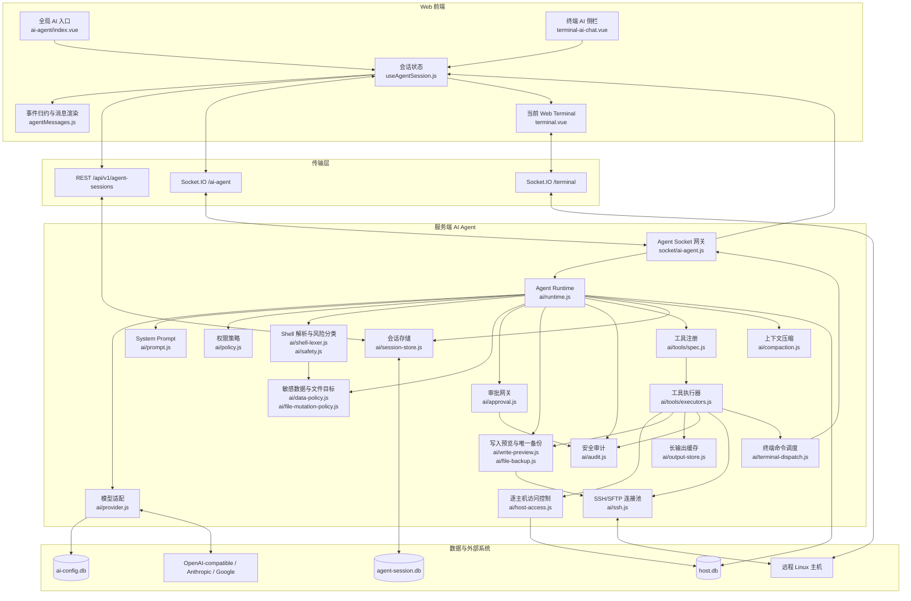
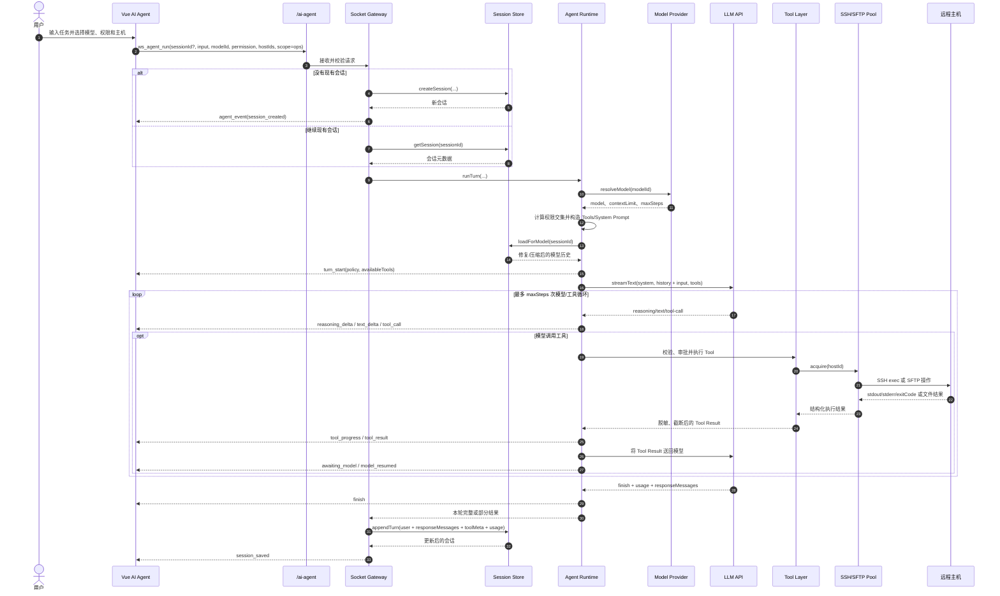
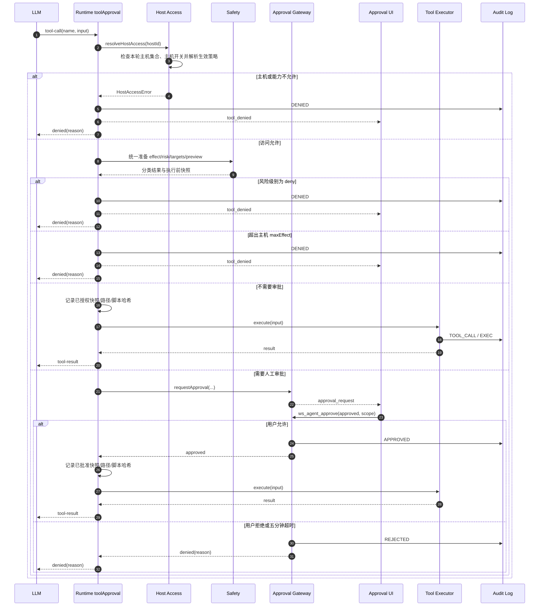
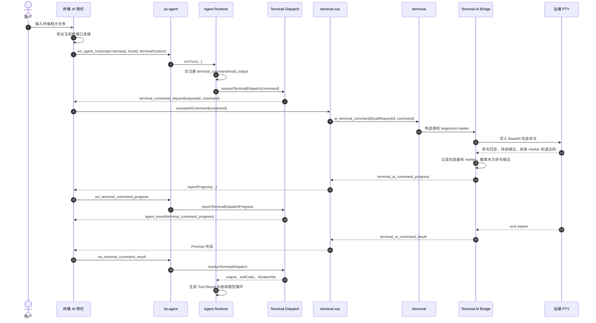
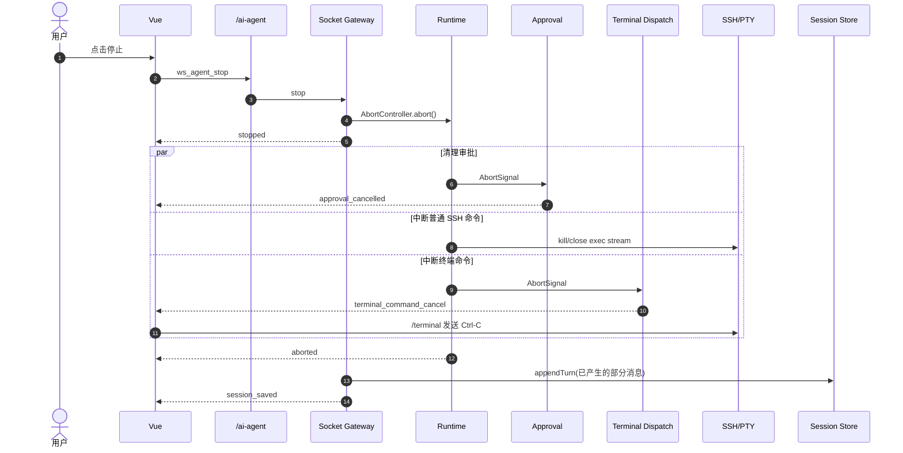
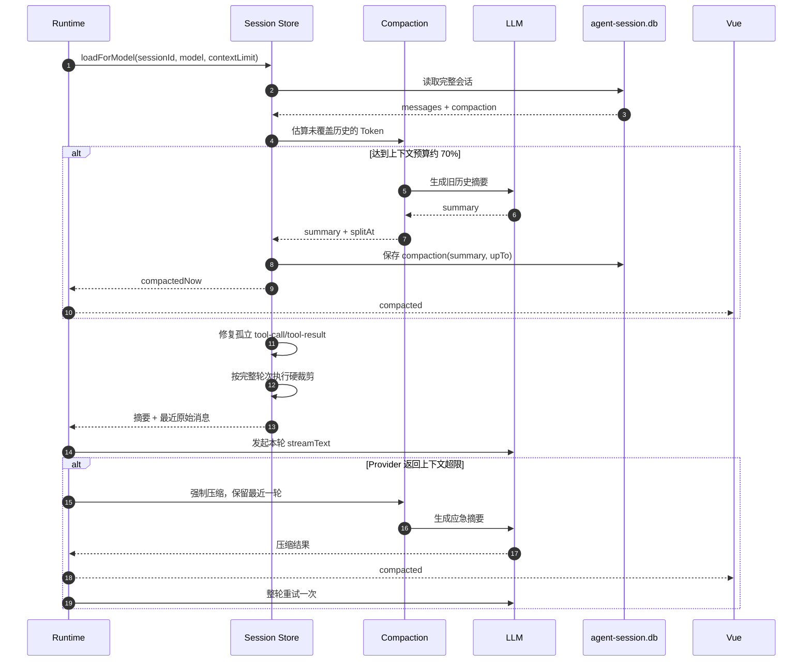

# EasyNode AI Agent 架构与时序

本文描述 EasyNode 当前 AI Agent 的实现架构、主要数据流、权限边界和关键时序。

## 1. 架构目标

AI Agent 不是由浏览器直接拼接历史并调用模型，而是采用“服务端持有会话状态、WebSocket 驱动单轮任务、模型通过受控工具操作主机”的架构。

核心原则：

- 会话历史以服务端数据库为准，前端每轮只提交本次输入。
- REST 负责会话 CRUD，WebSocket 负责实时运行、审批和中断。
- 模型看到当前作用域和主机选择允许的完整工具集；执行模式与 Plus 权限在每次调用时决定自动执行、审批或拒绝。
- 主机必须由用户在本轮请求中显式选择，空集合表示纯聊天模式。
- 会话权限与主机策略取交集，且每次工具调用都重新校验。
- 命令执行前依次经过访问控制、风险识别和人工审批。
- 普通运维 Agent 使用独立 SSH exec/SFTP 通道，终端 AI 使用当前 Web 终端 PTY。
- 工具调用、审批结果、风险信息和部分失败结果都进入会话与审计记录。

## 2. 总体架构



## 3. 分层职责

| 层 | 主要文件 | 职责 |
| --- | --- | --- |
| 前端容器 | `web/src/components/ai-agent/index.vue` | 全局运维助手、主机选择、模型和模式切换 |
| 终端容器 | `web/src/views/terminal/components/terminal-ai-chat.vue` | 绑定当前终端主机，接收和转发终端命令 |
| 前端会话层 | `web/src/composables/useAgentSession.js` | Socket 生命周期、会话状态、审批、中断、REST 会话操作 |
| 前端事件层 | `web/src/composables/agentMessages.js` | 将流式事件归约为文本、推理块和工具卡片 |
| Socket 网关 | `server/app/socket/ai-agent.js` | 鉴权、任务互斥、创建会话、启动 Runtime、最终落盘 |
| Runtime | `server/app/ai/runtime.js` | 模型调用、统一操作分类、审批决策、工具循环、事件映射和超限重试 |
| Provider | `server/app/ai/provider.js` | 将不同模型供应商适配为统一 AI SDK 模型 |
| 工具层 | `server/app/ai/tools/` | 工具元数据、Zod Schema、权限过滤和具体执行 |
| 安全层 | `policy.js`、`host-access.js`、`safety.js`、`data-policy.js`、`file-mutation-policy.js`、`approval.js` | 权限交集、主机边界、Shell/数据风险判定和人工审批 |
| 文件保护层 | `write-preview.js`、`file-backup.js`、`remote-path.js` | 真实路径识别、完整差异、执行前快照复核和不可覆盖备份 |
| 执行层 | `ssh.js`、`terminal-dispatch.js`、`socket/terminal.js` | 独立 SSH/SFTP 执行或当前 PTY 执行 |
| 持久化层 | `session-store.js`、`compaction.js` | 会话 CRUD、消息修复、摘要压缩、Token 统计 |

## 4. 两种 Agent 作用域

### 4.1 运维助手 `scope=ops`

- 可以选择零到多台主机。
- 未选择主机时不注册任何主机工具，退化为纯聊天。
- 选择主机后向模型开放运维工具集；执行模式不删减工具，具体调用按目标主机策略重新判定。
- 命令通过服务端独立 SSH exec channel 执行。
- 文件操作通过服务端 SFTP 执行。

### 4.2 终端助手 `scope=terminal`

- 必须绑定且只能绑定一台主机。
- 历史会话不能跨主机加载。
- 模型只获得 `terminal_command` 和 `read_output` 工具。
- `terminal_command` 不创建新的 SSH exec channel，而是发送到用户当前打开的 PTY。
- 当前实现发送消息时只附带终端连接和主机信息，不默认把整个终端滚动缓冲区写入模型历史。
- 通过 AI 执行的命令输出以结构化 Tool Result 进入会话历史。

## 5. 普通运维 Agent 主时序



### 5.1 Socket 网关的落盘保证

`appendTurn` 位于 Socket 网关的 `finally` 中。即使发生以下情况，本轮已产生的数据也会尽量保存：

- 用户主动停止；
- 工具执行失败；
- 模型流中途失败；
- 审批被拒绝或超时；
- 已经执行了工具，但模型没有生成最终回复。

这样可以避免“远端命令已经执行，但会话中没有记录”的情况。

## 6. 工具调用与审批时序



注意：

- `deny` 是硬拦截，不向用户提供继续执行按钮。
- `high` 即使在“授权”模式也必须逐次确认。
- Runtime 是分类和审批的唯一决策点；Executor 只消费已准备的分类结果，并复核文件快照、敏感读取真实路径或脚本哈希等会发生变化的对象。
- `run_script` 按实际脚本内容分类并复核内容哈希；普通静态脚本遵循当前模式矩阵。
- 终端命令遵循同一模式矩阵：审查模式下所有主机操作需审批，其他模式按操作和风险判定。
- 仅协助模式下 `normal/write` 且静态、单段、无重定向的少数服务生命周期操作支持“本会话允许同一操作”。当前仅覆盖 `systemctl`、`service`、`rc-service`、`docker` 和 `podman` 的明确 `start/restart/reload` 类操作。
- 会话授权指纹包含工具、主机和完整命令参数；文件写入、终端命令、复合/动态命令、删除和 `high` 操作始终单次审批。

## 7. 终端 AI 命令时序

终端 AI 涉及两条 Socket：

- `/ai-agent`：模型运行和 Agent 事件。
- `/terminal`：现有 WebSSH PTY 输入输出。



### 7.1 PTY 命令边界

当前 PTY 是交互式流，不能天然知道某条命令何时结束。服务端终端桥接层会：

1. 为每条 AI 命令生成随机 token。
2. 将原命令 Base64 编码，避免直接插入包装脚本时发生转义问题。
3. 在命令前后输出随机 `begin/end` marker。
4. 从 PTY 数据流中隐藏包装器和 marker。
5. 只收集 begin/end 之间的输出。
6. 从 end marker 读取退出码。

同一个终端同一时间只允许一条 AI 命令执行，单条命令最长等待 60 分钟。

## 8. 停止与断连时序



Socket 断连时还会：

- 中止当前 `AbortController`；
- 清理该会话挂起的审批；
- 清理终端调度请求；
- 清理该会话的长输出缓存；
- 普通运维作用域主动释放使用过的 Agent SSH 连接；
- 前端将仍在运行或等待审批的工具卡片标记为失败，避免永久转圈。

## 9. 上下文加载与压缩时序



上下文策略：

- 默认上下文预算为 64K Token，可由 AI 配置中的 `contextLimit` 覆盖。
- 估算达到预算的约 70% 时主动压缩。
- 正常压缩保留最近三轮原文。
- 厂商仍返回上下文超限时，强制压缩并仅重试一次。
- 摘要以 `{ summary, upTo }` 单独保存；原始消息在硬上限内仍可供前端查看。
- 单会话硬上限为 200 条消息或约 1.5 MiB，裁剪只从完整对话轮次边界进行。
- 中断导致的无结果 Tool Call 会补充合成错误结果，防止后续模型请求因消息不配对返回 400。

## 10. 权限模型

### 10.1 执行模式

每次操作统一分类为 `read | write | delete`，风险分为 `normal | high | deny`。

只有能够明确证明只读的 Shell 命令归为 `read`，明确删除归为 `delete`，其他静态命令默认归为 `normal/write`。因此新增普通 CLI 无需加入安全白名单；动态构造以及明确命中的高危、永久拒绝操作仍受负向规则约束。

| 预设 | 普通读取 | 高危读取 | 普通写入 | 高危写入 | 删除 |
| --- | --- | --- | --- | --- | --- |
| 审查 `review` | 主机读取审批；本地元数据自动 | 审批 | 审批 | 审批 | 审批 |
| 协助 `assist` | 自动 | 审批 | 审批 | 审批 | 审批 |
| 授权 `authorized` | 自动 | 审批 | 自动 | 审批 | 普通自动、高危审批 |

面向用户的模式描述为：审查模式下所有主机操作均需确认；协助模式仅明确只读的操作自动执行；授权模式自动执行未命中高危规则的操作。永久禁止的操作在所有模式下始终拦截。

### 10.2 主机策略

每台主机可配置：

```js
{
  enabled: true,
  maxEffect: 'write',
  maxMode: 'authorized'
}
```

最终生效策略：

```text
生效 mode = min(会话权限模式, 主机 maxMode)
写入和删除仅在 maxEffect = write 时允许
```

多主机会话展示工具并集，真正执行时按目标主机重新判定。

### 10.3 Shell 分类收敛

Shell 安全策略采用开放式授权模型，不维护“已知安全命令白名单”。解析层先拆分命令段、参数、重定向、管道、包装器和嵌套负载，分类层统一返回：

```js
{
  effect,             // read | write | delete
  risk,               // normal | high | deny
  category,
  reason,
  targets,
  traits,             // recursive | force | bulk | dynamic | sensitive | external | hidden | opaque
  hits,
  segments
}
```

判定规则：

1. 明确具有删除语义的操作归为 `delete`，包括文件删除或移动源、`truncate`、包/账号/数据库/容器/Kubernetes 删除等。
2. 只有静态且能够明确证明只读的命令归为 `read`。
3. 其他静态命令，包括尚未登记的新 CLI，默认归为 `normal/write`。
4. 变量、命令替换、`eval` 和无法静态确认的解释器代码归为 `high`，而不是因为命令名未知而升级。
5. 复合命令逐段分类并取最严格的 `effect` 和 `risk`；`sh -c`、`su -c`、远程 `ssh` 命令及 `systemd-run` 的静态负载会递归分析。
6. 镜像名、包名、URL、文件内容或普通目标中的产品关键词不会改变风险等级。

因此 `future-cli deploy app` 这类未知静态命令表现为：审查、协助模式审批，授权模式自动执行。新增普通 CLI 不需要补安全规则，只有新增的明确高危或永久拒绝机制需要进入负向规则集。

### 10.4 风险边界

| 等级 | 主要类别 | 行为 |
| --- | --- | --- |
| `deny` | `dd`；文件系统格式化/擦除；块设备直接写入；根目录或关键系统目录树整体销毁；fork bomb；递归锁死或完全放开关键系统目录权限；核心凭据外传；Base64 等隐藏载荷直接交给解释器执行 | 所有模式永久拒绝，只允许向用户展示原始命令和原因，不得自动改写、拆分或绕过 |
| `high` | 敏感读取/写入；强制、递归或批量删除；SSH、防火墙、网卡、账号和提权变更；关机重启；包卸载；数据库清空；容器强制删除、清理和卷删除；Kubernetes 命名空间或持久卷删除；动态/间接执行；文件外传；下载后执行 | 所有模式均需单次审批 |
| `normal` | 未命中上述负向规则的静态读取、写入和删除 | 按执行模式矩阵处理 |

该分类器是防误操作护栏，不是恶意命令沙箱；真正的权限边界仍是主机策略、目标主机集合和 SSH 账号自身权限。

## 11. 工具清单

| 工具 | 操作类型 | Plus 策略 | 执行通道 | 特殊规则 |
| --- | --- | --- | --- | --- |
| `host_list` | read | 免费 | NeDB | 只返回本轮显式选择的主机 |
| `host_status` | read | 免费 | SSH exec | 返回结构化系统状态 |
| `script_list` | read | 免费 | NeDB/脚本库 | 返回内置和用户脚本 |
| `run_script` | 按内容判定 | 写入/删除需 Plus | SSH exec | 按脚本内容分类并校验哈希 |
| `exec_command` | 按内容判定 | 写入/删除需 Plus | SSH exec | 经过统一 Shell 分类 |
| `read_file` | read | 免费 | SFTP | 敏感读取需审批 |
| `write_file` | write | Plus | SFTP | 默认备份，高危路径展示完整 diff |
| `list_dir` | read | 免费 | SFTP | 返回类型、大小、权限和时间 |
| `read_output` | read | 免费 | 内存缓存 | 回读被截断的工具输出 |
| `terminal_command` | 按内容判定 | 写入/删除需 Plus | 当前 Web PTY | 按实际命令分类 |

工具规格是模型 Schema、System Prompt 和前端能力展示的共同数据源，避免多处声明发生漂移。

### 11.1 文件与脚本执行不变量

- `read_file` 在审批前解析真实路径，并同时检查请求路径与真实路径。敏感读取执行时必须匹配同一次工具调用批准的真实路径。
- `write_file` 仅接受绝对路径、有效 UTF-8 文本和最多 256 KiB 的完整内容；权限值只能是 3 或 4 位八进制数字。
- 写入前读取原文件并生成完整替换 diff，快照哈希覆盖主机、请求路径、真实路径、原内容、权限、备份选项和新内容。执行前重新生成快照，任何变化都会使原授权失效。
- 覆盖已有文件时默认创建 `${原路径}.bak.<UTC 时间戳>`；同一毫秒或并发碰撞时追加序号，并使用 SFTP 独占创建，绝不覆盖已有备份。
- `run_script` 只执行脚本库返回的原始内容。Runtime 按实际脚本分类并记录 SHA-256，Executor 执行前重新读取脚本并校验哈希。
- Executor 不重新解释不可变命令，只消费 Runtime 已保存的 `effect/risk`；仅保留文件快照、敏感读取真实路径和脚本哈希这类 TOCTOU 复核。

## 12. 长输出与敏感信息

### 12.1 长输出

- SSH 命令单次最多收集约 2 MiB，超过后标记为截断。
- 工具结果超过约 8 KiB 时，返回头部、尾部和临时 `handle`。
- 模型可调用 `read_output(handle, pattern, offset, limit)` 分段回读。
- 临时输出缓存默认保留 30 分钟，最多 200 项，并在会话断开时清理。

### 12.2 脱敏

普通工具结果返回模型前会自动脱敏。高危读取经过用户单次批准后，真实内容会发送给当前 AI Provider；未经审批的意外凭据输出仍会脱敏。核心凭据的明确外传命令直接归为 `deny`。

长输出 `handle` 与创建它的会话绑定，其他会话不能回读；存入缓存的是当前工具调用经过脱敏策略处理后的内容。

## 13. 模型与运行配置

运维助手与终端助手共用 AI 设置：

| 配置 | 说明 |
| --- | --- |
| `providerType` | `openai-compatible`、`anthropic` 或 `google` |
| `apiUrl` / `apiKey` | Provider 的 API 前缀与凭据 |
| `models` | 允许在 Agent 中选择的模型 ID 列表；OpenAI-compatible Provider 支持从接口获取候选模型 |
| `contextLimit` | 模型上下文窗口，默认 65,536 Token |
| `maxSteps` | 单轮最多模型/工具迭代次数，默认 25，服务端上限 50 |

Provider 层将三类服务适配为统一的 AI SDK 模型。请求中的模型 ID 必须位于已配置列表中；未显式选择时使用列表第一项。

## 14. 会话数据模型

`agent-session.db` 中单条记录的主要结构：

```js
{
  _id,
  title,
  scope,              // ops | terminal
  hostId,             // terminal 会话绑定主机
  hostIds,            // 本会话主机集合
  modelId,
  permission,
  messages,           // AI SDK ModelMessage[]
  turnMeta: [
    {
      createdAt,
      usage
    }
  ],
  toolMeta: {
    [toolCallId]: {
      tool,
      effect,
      risk,
      riskReason,
      riskCategory,
      targets,
      approved,
      approvalScope,
      approvalCached,
      denied,
      sensitiveDisclosure,
      durationMs,
      failed
    }
  },
  usage,
  compaction: {
    summary,
    upTo,
    createdAt
  },
  createdAt,
  updatedAt
}
```

会话列表接口只返回摘要字段，不返回可能达到数百 KiB 的 `messages`。完整历史通过详情接口按需加载。

Agent 会话不按时间自动清理，仅支持用户主动删除单个会话或清空会话。

## 15. 接口与事件协议

### 15.1 REST

| 方法 | 路径 | 用途 |
| --- | --- | --- |
| `GET` | `/api/v1/agent-sessions` | 按 scope/hostId 获取会话列表 |
| `DELETE` | `/api/v1/agent-sessions` | 按作用域清空会话 |
| `GET` | `/api/v1/agent-sessions/:id` | 获取完整会话 |
| `PUT` | `/api/v1/agent-sessions/:id` | 更新标题、主机、模型或权限 |
| `POST` | `/api/v1/agent-sessions/:id/fork` | 从指定问答或回答创建分支 |
| `PUT` | `/api/v1/agent-sessions/:id/messages/:turnIndex` | 截断旧分支并准备重新发送编辑后的消息 |
| `DELETE` | `/api/v1/agent-sessions/:id` | 删除会话 |

### 15.2 客户端发送到 `/ai-agent`

| 事件 | 主要载荷 | 用途 |
| --- | --- | --- |
| `ws_agent_run` | `sessionId?`、`input`、`modelId`、`permission`、`hostIds`、`scope`；终端作用域另带 `hostId`、`terminalPermission`、`terminalContext` | 启动一轮任务 |
| `ws_agent_approve` | `requestId`、`approved`、`scope` | 回复审批 |
| `ws_agent_stop` | 无 | 中止当前任务 |
| `ws_terminal_command_progress` | `requestId`、`output`、`durationMs` | 回传 PTY 命令进度 |
| `ws_terminal_command_result` | `requestId`、`output`、`exitCode` | 回传 PTY 最终结果 |

### 15.3 服务端统一发送 `agent_event`

主要 `type`：

| 类别 | type |
| --- | --- |
| 初始化 | `ready`、`session_created`、`turn_start`、`pending_approvals` |
| 模型流 | `reasoning_delta`、`text_delta`、`step_finish`、`finish` |
| 工具 | `tool_call`、`tool_progress`、`tool_result`、`tool_denied`、`tool_requires_plus` |
| 模型等待 | `awaiting_model`、`model_resumed` |
| 审批 | `approval_request`、`approval_timeout`、`approval_cancelled` |
| 终端 | `terminal_command_request`、`terminal_command_progress`、`terminal_command_cancel` |
| 上下文 | `history_repaired`、`compacted` |
| 生命周期 | `session_saved`、`aborted`、`stopped`、`error`、`stream_error` |

## 16. 关键实现文件

```text
server/app/
├── ai/
│   ├── runtime.js             # 单轮 Agent 编排
│   ├── provider.js            # 模型供应商适配
│   ├── prompt.js              # System Prompt
│   ├── policy.js              # 双轴权限模型
│   ├── host-access.js         # 逐主机执行边界
│   ├── safety.js              # Shell 风险分类
│   ├── shell-lexer.js         # Shell 词法解析
│   ├── data-policy.js         # 敏感读取路径分类
│   ├── file-mutation-policy.js # Shell 文件变更目标提取
│   ├── write-preview.js       # write_file 完整差异与快照
│   ├── file-backup.js         # 唯一且不可覆盖的备份
│   ├── remote-path.js         # 远程真实路径解析
│   ├── approval.js            # 人工审批挂起/恢复
│   ├── audit.js               # 安全审计
│   ├── redact.js              # 输出脱敏
│   ├── ssh.js                 # Agent SSH/SFTP 连接池
│   ├── terminal-dispatch.js   # 当前 PTY 调度
│   ├── output-store.js        # 长输出缓存
│   ├── compaction.js          # 上下文摘要
│   ├── session-store.js       # Agent 会话持久化
│   ├── plus.js                # 加密后的 Plus 变更工具实现
│   └── tools/
│       ├── spec.js            # 工具元数据与 Schema
│       ├── index.js           # AI SDK Tool 装配
│       └── executors.js       # 工具执行器
├── script-library.js          # 内置/用户脚本统一读取
├── controller/
│   └── agent-session.js       # 会话 REST Controller
└── socket/
    ├── ai-agent.js            # Agent WebSocket 网关
    └── terminal.js            # PTY AI 命令边界协议

web/src/
├── components/ai-agent/       # 全局 Agent、审批卡、工具卡、会话列表和模式切换
├── components/common/
│   └── chat-sender.vue        # 运维/终端助手共用输入框
├── composables/
│   ├── useAgentSession.js     # 前端会话与 Socket 状态
│   ├── agentMessages.js       # Agent 事件归约
│   └── agentTools.js          # 前端工具能力展示
└── views/terminal/components/
    ├── terminal-ai-chat.vue   # 终端 AI 侧栏
    └── terminal.vue           # PTY 命令发送、进度和取消
```

## 17. 验证覆盖

暂存区实现包含以下自动化验证：

- `server/test/test-ai-safety.js`：三档模式矩阵、Shell 复合命令、嵌套负载、路径变体、文件目标、高危和永久拒绝规则。
- `server/test/test-ai-access.js`：主机隔离、纯聊天模式、Shell 转义、审批指纹、终端取消和执行步数上限。
- `server/test/test-ai-data.js`：敏感路径、脱敏、写入预览、快照与唯一备份。
- `server/test/test-ai-session.js`：消息修复、会话 CRUD、编辑、分支、持久化和用量累计。
- `server/test/test-ai-compaction.js`：Token 估算、摘要切分、主动/应急压缩和上下文超限识别。
- `web/test/test-agent-messages.js`：流式事件归约、工具卡、历史还原、回答重生成和不同事件来路的一致性。

常用校验命令：

```bash
yarn workspace server run test:ai
yarn workspace server run lint
yarn workspace web run test
yarn workspace web run lint
yarn workspace web run build
git diff --check
```
