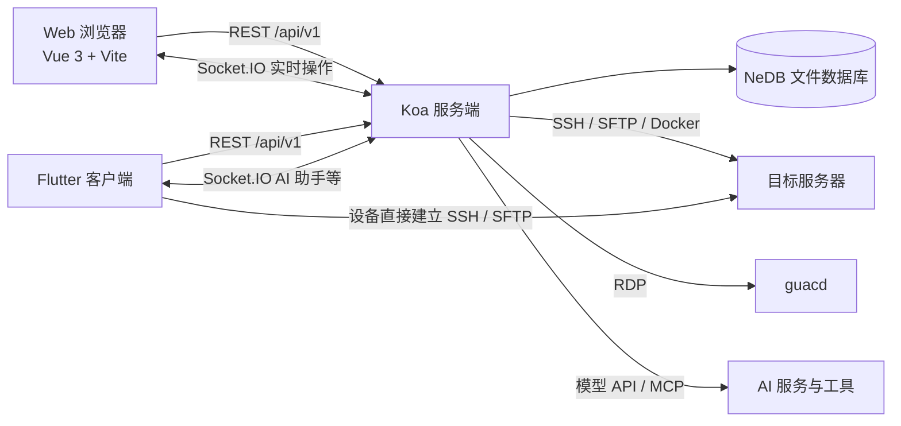

# EasyNode 项目架构

## 1. 定位与总体结构

EasyNode 是一个 Linux 服务器管理面板，提供主机管理、SSH 终端、SFTP、RDP、Docker、脚本与定时任务、批量操作和 AI 助手。仓库包含 Web 前端、服务端和 Flutter 客户端；两种客户端共享服务端的账户、主机配置及业务数据。



关键区别：Web 端的终端等实时操作由服务端中转；Native 端从服务端取得加密的连接参数后，在设备上直接连接目标主机。目标主机的网络可达性要求因此不同。

## 2. 仓库分层

| 目录 | 技术与职责 | 主要入口 |
| --- | --- | --- |
| `web/` | Vue 3、Vue Router、Pinia、Element Plus；管理界面和浏览器端终端 | `web/src/main.js`、`web/src/router/index.js` |
| `server/` | Node.js ES modules、Koa、Socket.IO；API、认证、业务逻辑、实时连接与持久化 | `server/index.js`、`server/app/main.js`、`server/app/server.js` |
| `native/` | Flutter、Riverpod、Dio、dartssh2；移动及桌面原生客户端 | `native/lib/main.dart`、`native/lib/app.dart` |
| `scripts/`、`local-script/` | 维护、备份和发布相关脚本 | 各脚本入口 |

根目录使用 Yarn workspaces 管理 `server` 和 `web`；Flutter 依赖由 `native/pubspec.yaml` 单独管理。服务端当前的 `package.json` 声明了 `"type": "module"`，源码使用 `import`/`export`。

## 3. 服务端

启动时，`server/app/main.js` 依次初始化数据库、注册调度任务、创建 HTTP/HTTPS 服务，并启动相关后台能力。`server/app/server.js` 将 Koa 中间件、Socket.IO 命名空间和 RDP 代理装配到服务上。

### HTTP 请求链路

API 统一使用 `/api/v1` 前缀，路由定义在 `server/app/router/routes.js`，由 `server/app/router/index.js` 注册。主要处理顺序由 `server/app/middlewares/index.js` 指定：

1. IP 访问规则、SFTP 缓存文件、压缩、SPA history 回退和静态资源。
2. 统一响应与请求体解析、访问日志。
3. 身份校验、HTTP 方法检查和业务路由。

控制器位于 `server/app/controller/`，复杂业务与后台任务位于 `server/app/services/` 和 `server/app/ai/`。例如主机、脚本、凭据、通知、定时任务与 AI 会话分别有对应控制器或服务。

### 实时连接

`server/app/socket/` 通过 Socket.IO 提供以下命名空间：

| 命名空间 | 用途 |
| --- | --- |
| `/terminal` | SSH 终端输入输出 |
| `/sftp-v2` | 文件浏览与操作 |
| `/docker` | Docker 操作 |
| `/onekey` | 批量指令执行 |
| `/server-status` | 主机状态监控 |
| `/file-transfer` | 文件传输 |
| `/ai-agent` | AI 助手事件、工具调用与审批 |

这些命名空间通过 `server/app/utils/ws-tool.js` 的 `createSecureWs` 建立鉴权连接。RDP 另经 `guacamole-lite` 和 `guacd` 处理，并在 WebSocket 代理入口校验 IP 与会话。

### 数据层

服务端使用 `@seald-io/nedb`，数据库文件默认放在 `server/app/db/`。主机、凭据、分组、脚本、会话、AI 配置和定时任务等数据分文件保存。各集合通过 `server/app/utils/db-class.js` 中的类获取单例；文件路径集中定义于 `server/app/config/index.js`。

## 4. Web 前端

页面路由在 `web/src/router/index.js`：登录、服务器、终端、RDP、凭据、文件、批量操作、脚本、定时任务和设置。页面实现集中在 `web/src/views/`，跨页面状态在 `web/src/store/`。

普通业务请求通过 `web/src/api/index.js` 和 Axios 访问服务端。终端、SFTP、Docker、监控和 AI 助手使用 Socket.IO 处理持续交互。终端显示使用 xterm.js，RDP 使用 Guacamole 客户端。开发时 Vite 默认运行于 `18090`，将 `/api/v1` 与 `/sftp-cache` 代理到本地服务端 `8082`；配置见 `web/vite.config.mjs`。

## 5. Flutter 客户端

`native/lib/app.dart` 负责启动装配和登录态切换；`native/lib/state/` 用 Riverpod 管理认证、主机列表、终端会话等状态。`native/lib/features/` 按功能划分，包含服务器、终端、SFTP、Docker、脚本、定时任务、设置和 AI 助手。

业务 API 通过 `native/lib/core/api/api_client.dart` 中的 Dio 客户端访问 `/api/v1`。普通偏好存入 SharedPreferences，令牌、Cookie 等敏感数据由 `flutter_secure_storage` 保存。

Native SSH 连接流程：

1. 客户端生成临时 AES 密钥，用服务端公钥加密后调用 `POST /api/v1/native/ssh-connection`。
2. 服务端返回 AES-GCM 加密的连接参数；客户端解密为 `SshConnectionConfig`。
3. `dartssh2` 在设备上与目标主机建立 SSH 会话；SFTP 也由设备直接连接。

对应实现见 `native/lib/features/servers/server_repository.dart` 和 `native/lib/features/terminal/ssh_terminal_controller.dart`。这套加密协议涉及服务端与 Native 端的互操作，调整时需要同步修改两端。

## 6. 认证与安全边界

首次启动时服务端生成管理员凭据与 RSA 密钥，并将初始账号密码输出到启动日志。登录先获取公钥，再用 RSA 加密密码提交。后续受保护的 API 同时校验请求头中的 token 和 session Cookie；登录、公钥接口位于认证白名单。Socket.IO 连接也走会话鉴权。

面板还提供 MFA、IP 访问规则、会话管理及 HTTPS。默认配置启用自签名 HTTPS：HTTP 端口 `8082`，HTTPS 端口 `8092`。仓库的 `docker-compose.yml` 将 HTTP 端口仅绑定到 `127.0.0.1`，并设置 `COOKIE_SECURE=true`。

## 7. 开发与部署入口

```bash
yarn dev                          # 同时启动 Web 与服务端
yarn workspace web run dev        # 仅启动 Vite
yarn workspace server run local   # 仅启动 Koa 服务端
yarn workspace web run build      # 构建 Web
cd native && flutter run          # 运行 Flutter 客户端
```

仓库提供 `docker-compose.yml`，编排 EasyNode、`guacd` 和自动更新服务。部署及环境变量说明见根目录 `README.md`。
