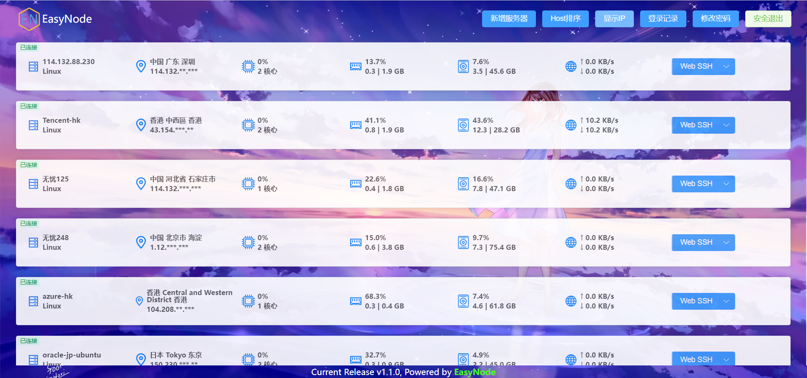
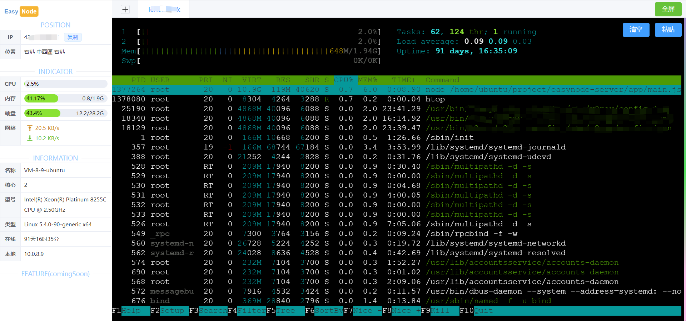

# EasyNode

> 一个简易的个人Linux服务器管理面板(基于Node.js)

<!-- - [EasyNode](#easynode) -->
  - [功能简介](#功能简介)
  - [安装指南](#安装指南)
    - [服务端安装](#服务端安装)
      - [Docker镜像](#docker镜像)
      - [一键脚本](#一键脚本)
      - [手动部署](#手动部署)
    - [客户端安装](#客户端安装)
      - [X86架构](#x86架构)
      - [ARM架构](#arm架构)
  - [升级指南](#升级指南)
    - [服务端](#服务端)
    - [客户端](#客户端)
    - [版本日志](#版本日志)
  - [安全与说明](#安全与说明)
  - [Q&A](#qa)
  - [感谢Star](#感谢star)
  - [License](#license)

## 功能简介

> 多服务器管理; 通过`websocker实时更新`服务器基本信息: **系统、公网IP、CPU、内存、硬盘、网卡**等



> 基于浏览器解决`SSH跨端同步`问题——**Web SSH**



## 安装指南

### 服务端安装

- 依赖Node.js环境

- 占用端口：8082(http端口)、8083(https端口)、22022(客户端端口)

- 建议使用**境外服务器**(最好延迟低)安装服务端，客户端信息监控与webssh功能都将以`该服务器作为跳板机`

- https服务需自行配置证书，或者使用`nginx反代`解决(推荐)

#### Docker镜像

> 注意：网速统计功能可能受限，docker网络将使用host模式(与宿主机共享端口，占用: 8082、22022)

```shell
docker run -d --net=host chaoszhu/easynode
```

访问：http://yourip:8082

#### 一键脚本

- 依赖Linux基础命令：curl wget git zip tar；如未安装请先安装：

> ubuntu/debian: apt install curl wget git zip tar -y
> 
> centos: yum install curl wget git zip tar -y

```shell
wget -qO- --no-check-certificate https://ghproxy.com/https://raw.githubusercontent.com/chaos-zhu/easynode/v1.1/easynode-server-install.sh | bash
```

访问：http://yourip:8082

- 查看日志：`pm2 log easynode-server`
- 启动服务：`pm2 start easynode-server`
- 停止服务：`pm2 stop easynode-server`
- 停止服务：`pm2 delete easynode-server`

#### 手动部署

1. 安装Node.js
2. 安装pm2、安装yarn
3. 拉取代码：git clone https://github.com/chaos-zhu/easynode.git
4. 安装依赖：yarn
5. 启动服务：pm2 start server/app/main.js --name easynode-server
6. 访问：http://yourip:8082

- 默认登录密码：admin(首次部署完成后请及时修改).

6. 部署https服务
- 部署https服务需要自己上传域名证书至`\server\app\config\pem`，并且证书和私钥分别命名：`key.pem`和`cert.pem`
- 配置域名：vim server/app/config/index.js  在domain字段中填写你解析到服务器的域名
- pm2 restart easynode-server
- 不出意外你就可以访问https服务：https://domain:8083

---

### 客户端安装

- 占用端口：22022

#### X86架构

```shell
wget -qO- --no-check-certificate https://ghproxy.com/https://raw.githubusercontent.com/chaos-zhu/easynode/v1.1/easynode-client-install-x86.sh | bash
```

#### ARM架构

```shell
wget -qO- --no-check-certificate https://ghproxy.com/https://raw.githubusercontent.com/chaos-zhu/easynode/v1.1/easynode-client-install-arm.sh | bash
```

> 卸载

```shell
wget -qO- --no-check-certificate https://ghproxy.com/https://raw.githubusercontent.com/chaos-zhu/easynode/v1.1/easynode-client-uninstall.sh | bash
```

> 查看客户端状态：`systemctl status easynode-client`
> 
> 查看客户端日志: `journalctl --follow -u easynode-client`
> 
> 查看详细日志：journalctl -xe

---

## 升级指南

- **v1.0 to v1.1**

### 服务端

> v1.1对所有的敏感信息全部加密，所有的v1.0为加密的信息全部失效. 主要影响已存储的ssh密钥.
> 
> **还原客户端列表：** 先备份`app\config\storage\host-list.json`, 使用一键脚本或者手动部署的同志安装好使用备份文件覆盖此文件即可。
> 
> 使用docker镜像的v1.0一键脚本**未做**文件夹映射，有能力的自己从镜像里把备份抠出来再重新构建镜像.

### 客户端

> v1.1未对客户端包进行改动，客户端无需重复安装. 不会备份的在面板重新添加客户端机器即可.

### 版本日志

- [CHANGELOG](./CHANGELOG.md)

## 安全与说明

> 本人非专业后端，此服务全凭兴趣开发. 由于知识受限，并不能保证没有漏洞的存在，生产服务器请慎重使用此服务.

> 所有服务器信息相关接口已做`jwt鉴权`, 安全信息均使用加密传输与储存!

> webssh功能需要的密钥信息全部保存在服务端服务器的`app\config\storage\ssh-record.json`中. 在保存ssh密钥信息到服务器储存与传输过程皆已加密，`不放心最好套https使用`

<!-- ## 技术架构

> 待更新... -->

<!-- ## 后续版本功能方向

- SFTP
- 在线文件编辑
- 终端常用指令
- 面板UI优化(列表\卡片\自定义背景)
- 登录IP白名单
- 版本更新检测
- 终端tab一键分屏
- 登录有效期(目前默认1h)
- 面板登录通知(tg or wx?)
- 定时任务 -->

## Q&A

- [Q&A](./Q%26A.md)

## 感谢Star

[](https://github.com/chaos-zhu/easynode/stargazers)

<!-- [](https://starchart.cc/chaos-zhu/easynode) -->

## License

[MIT](LICENSE). Copyright (c).
