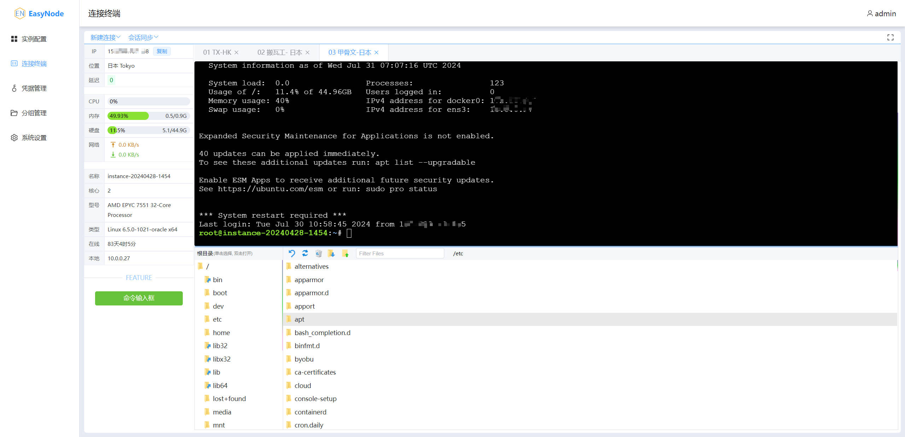
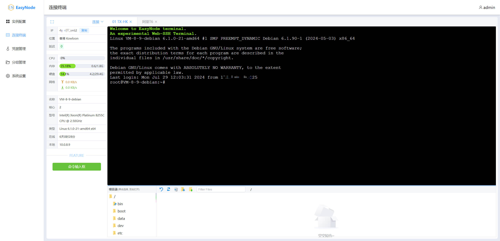

# EasyNode v2.0

> [!WARNING]
> 初次部署EasyNode，登录系统后务必记得修改默认账户密码 `admin/admin`！

> [!WARNING]
> 强烈建议使用 **iptables** 或 **fail2ban** 等安全服务限制IP访问，谨慎暴露面板服务到公网。

> [!NOTE]
> 客户端信息监控与webssh功能都将以`该服务器作为中转`。中国大陆连接建议使用香港、新加坡、日本、韩国等地区的低延迟服务器来安装服务端

  - [功能简介](#功能简介)
  - [安装指南](#安装指南)
    - [服务端安装](#服务端安装)
      - [Docker镜像](#docker镜像)
      - [一键脚本](#一键脚本[暂未编写])
    - [客户端安装](#客户端安装)
      - [X86架构](#x86架构)
      - [ARM架构](#arm架构)
  - [升级指南](#升级指南)
    - [服务端](#服务端)
    - [客户端](#客户端)
    - [版本日志](#版本日志)
  - [安全与说明](#安全与说明)
  - [开发](#开发)
  - [Q&A](#qa)
  - [感谢Star](#感谢star)
  - [License](#license)

## 功能简介

> 一个多功能webssh终端; 通过ws实时更新服务器基本信息: **系统、公网IP、CPU、内存、硬盘、网卡**等



> 基于浏览器解决`SSH&SFTP跨端`烦恼——**Web SSH**&**Web SFTP**



## 安装指南

### 服务端安装

- 依赖Node.js环境

- 占用端口：8082(http端口)、22022(客户端端口)

#### Docker镜像

```shell
docker run -d --net=host --name=easynode-server -v $PWD/easynode/db:/easynode/server/app/db chaoszhu/easynode
```
访问：http://yourip:8082

<!-- #### 一键脚本

- **依赖Linux基础命令工具：curl wget git zip tar；如未安装请先安装：**

> ubuntu/debian: `apt install curl wget git zip tar -y`
>
> centos: `yum install curl wget git zip tar -y`

- 运行环境：[Node.js](https://nodejs.org/en/download/) **v14+**

```shell
wget -qO- --no-check-certificate https://raw.githubusercontent.com/chaos-zhu/easynode/v1.2/easynode-server-install.sh | bash
```

访问：http://yourip:8082

- 查看日志：`pm2 log easynode-server`
- 启动服务：`pm2 start easynode-server`
- 停止服务：`pm2 stop easynode-server`
- 删除服务：`pm2 delete easynode-server` -->

---

### 客户端安装

- 占用端口：22022

#### X86架构

```shell
wget -qO- --no-check-certificate https://mirror.ghproxy.com/https://raw.githubusercontent.com/chaos-zhu/easynode/v1.2/easynode-client-install-x86.sh | bash
```

#### ARM架构

```shell
wget -qO- --no-check-certificate https://mirror.ghproxy.com/https://raw.githubusercontent.com/chaos-zhu/easynode/v1.1/easynode-client-install-arm.sh | bash
```

> 卸载

```shell
wget -qO- --no-check-certificate https://mirror.ghproxy.com/https://raw.githubusercontent.com/chaos-zhu/easynode/v1.2/easynode-client-uninstall.sh | bash
```

> 查看客户端状态：`systemctl status easynode-client`
>
> 查看客户端日志: `journalctl --follow -u easynode-client`
>
> 查看详细日志：journalctl -xe

---

## 升级指南

2.0版本无论前后端均作了大量的重构工作，1.0版本**不支持**升级到2.0版本

### 版本日志

- [CHANGELOG](./CHANGELOG.md)

## 安全与说明

> 本人非专业后端，此服务全凭兴趣开发. 由于知识受限，并不能保证没有漏洞的存在，所以请务必使用`iptables`限制ip访问该服务，且不要轻易暴露此服务在公网。

## 开发

1. 拉取代码，环境 `nodejs``>=20`
2. cd到项目根目录，`yarn install` 执行安装依赖
3. `yarn dev`启动项目
4. web: `http://localhost:18090/`

## Q&A

- [Q&A](./Q%26A.md)

## 感谢Star

- 你的Star是我更新的动力，感谢~

## License

[MIT](LICENSE). Copyright (c).
