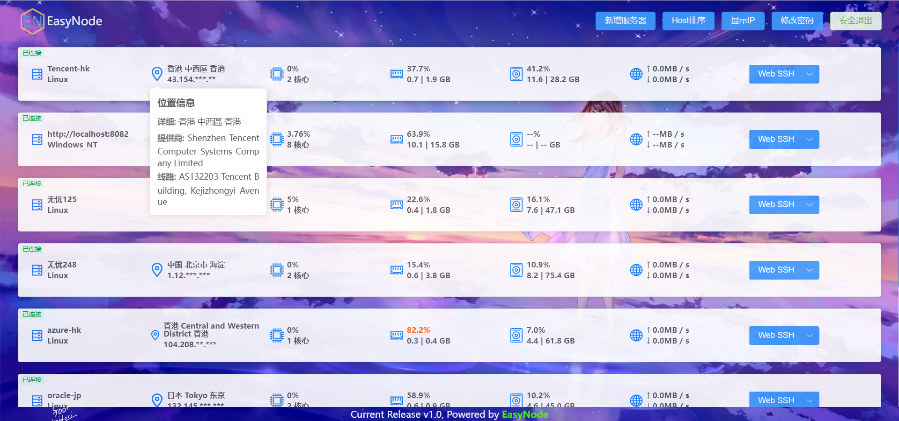
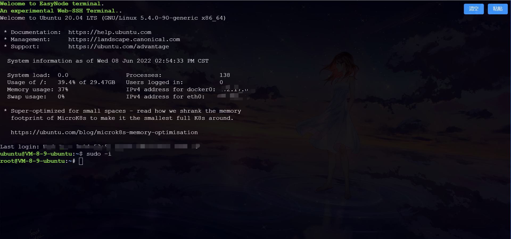

# EasyNode

> 一个简易的个人Linux服务器管理面板(基于Node.js)

## 功能

> 多服务器管理; 通过`websocker实时更新`服务器基本信息: **系统、公网IP、CPU、内存、硬盘、网卡**等



> 基于浏览器解决`SSH跨端同步`问题——**Web SSH**



## 安装指南

### 服务端安装

- 依赖Node.js环境

- 占用端口：8082(http端口)、8083(https端口)、22022(客户端端口)

- 建议使用**境外服务器**(最好延迟低)安装服务端，客户端信息监控与webssh功能都将以`该服务器作为跳板机`

- https服务需自行配置证书，或者使用`nginx反代`解决(推荐)

#### Docker镜像

> 注意：网速统计功能可能受限，预计v2.0版本切换方案

- docker run -d -p 8082:8082 -p 22022:22022 chaoszhu/easynode

#### 一键脚本

> 编写中...
<!-- ```shell
# 国外环境
wget -N --no-check-certificate xxx  && bash easynode-server-install.sh

# 国内环境
wget -N --no-check-certificate xxx  && bash easynode-server-install.sh
``` -->

#### 手动部署

1. 安装Node.js
2. 安装pm2、安装yarn
3. 拉取代码：git clone https://github.com/chaos-zhu/easynode.git
4. 安装依赖：yarn
5. 配置域名：vim server/app/config/index.js  在domain字段中填写你解析到服务器的域名
6. 启动服务：pm2 start server/app/main.js
7. 访问：http://domain:8082

- 默认登录密码：admin(首次部署完成后请及时修改).

6. 部署https服务
- 部署https服务需要自己上传域名证书至`\server\app\config\pem`，并且证书和私钥分别命名：`key.pem`和`cert.pem`
- 不出意外你就可以访问https服务：https://domain:8083

---

### 客户端安装

- 占用端口：22022

> 安装：支持后续一键升级

```shell
wget -N --no-check-certificate https://ghproxy.com/https://raw.githubusercontent.com/chaos-zhu/easynode/master/easynode-client-install.sh && bash easynode-client-install.sh

```

> 卸载：无服务残留

```shell
wget -N --no-check-certificate https://ghproxy.com/https://raw.githubusercontent.com/chaos-zhu/easynode/master/easynode-client-uninstall.sh && bash easynode-client-uninstall.sh
```

> 查看客户端日志

```shell
journalctl --follow -u easynode-client
```

---

## 安全与说明

> 本人非专业后端，此服务全凭兴趣开发. 由于知识受限，并不能保证没有漏洞的存在，生产服务器请慎重使用此服务.

> 所有服务器信息相关接口已做`jwt鉴权`

> webssh功能需要的密钥信息全部保存在服务端服务器的`app\config\storage\ssh-record.json`中. 在保存ssh密钥信息到服务器时，v1.0版本未做加密，`如果使用此功能最好带上https`, 并且保管好你的服务端服务器密码.

## 技术架构

> 待更新...

## v2.0功能方向

- 终端快捷键

- 终端常用指令

- 终端多tab支持

- 终端主题

- FTP文件系统

- 支持完整功能的docker镜像


## License

[MIT](LICENSE). Copyright (c).
