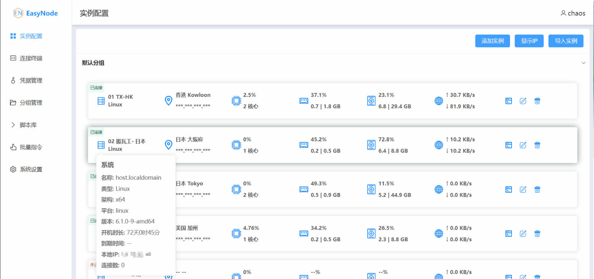

<div align="center">

# EasyNode

_✨ 一个多功能Linux服务器WEB终端面板(webSSH&webSFTP) ✨_

</div>

<p align="center">
  <a href="https://github.com/chaos-zhu/easynode/releases/latest">
    
  </a>
  <a href="https://github.com/chaos-zhu/easynode/actions">
    
  </a>
  <a href="https://hub.docker.com/repository/docker/chaoszhu/easynode">
    
  </a>
  <a href="https://github.com/chaos-zhu/easynode/releases/latest">
    
  </a>
  <a href="https://raw.githubusercontent.com/chaos-zhu/easynode/main/LICENSE">
    
  </a>
</p>

<p align="center">
  <a href="#功能">功能</a>
  ·
  <a href="#面板展示">面板展示</a>
  ·
  <a href="#项目部署">项目部署</a>
  ·
  <a href="#监控服务安装">监控服务安装</a>
  ·
  <a href="#安全与建议">安全与建议</a>
  ·
  <a href="#常见问题">常见问题</a>
  <!-- ·
  <a href="#Plus功能">Plus版功能</a> -->
</p>

## 功能

+ [x] 功能完善的**SSH终端**&**SFTP**
+ [x] 跳板机功能,拯救被墙实例与龟速终端输入
+ [x] AI对话组件，终端对话联动
+ [x] 批量导入、导出、编辑服务器配置、脚本等
+ [x] 脚本库
+ [x] 实例分组
+ [x] 凭据托管
+ [x] 多渠道通知
+ [x] 批量下发指令
+ [x] 自定义终端主题

## 面板展示



## 项目部署

- v3.1.0版本开始用户名密码不再是admin/admin. 需查看**终端日志**，另外登录后请及时修改，避免日志残留敏感信息。请牢记账号密码，出于安全原因，不提供一键重置密码的脚本
- 默认web端口：**8082**

### docker-compose部署-自动更新（推荐）

```shell
# 1. 创建easynode目录
mkdir -p /root/easynode && cd /root/easynode

# 2. 下载docker-compose.yml文件
wget https://git.221022.xyz/https://raw.githubusercontent.com/chaos-zhu/easynode/main/docker-compose.yml

# 3. 启动服务
docker-compose up -d
```

### docker镜像

```shell
docker run -d -p 8082:8082 --restart=always -v /root/easynode/db:/easynode/app/db chaoszhu/easynode
```

环境变量：
- `DEBUG`: 启动debug日志 0：关闭 1：开启, 默认关闭

注意: **docker默认不启用ipv6，请自行配置或者使用支持ipv6的跳板机中转.**

## 监控服务安装

- 监控服务用于实时向面板推送**系统、公网IP、CPU、内存、硬盘、网卡**等基础信息

- 默认端口：**22022**

> 安装

```shell
# 使用默认端口22022安装
curl -o- https://git.221022.xyz/https://raw.githubusercontent.com/chaos-zhu/easynode/main/client/easynode-client-install.sh | bash

# 使用自定义端口安装, 例如54321
curl -o- https://git.221022.xyz/https://raw.githubusercontent.com/chaos-zhu/easynode/main/client/easynode-client-install.sh | bash -s -- 54321
```

> 卸载

```shell
curl -o- https://git.221022.xyz/https://raw.githubusercontent.com/chaos-zhu/easynode/main/client/easynode-client-uninstall.sh | bash
```

> 查看监控服务状态：`systemctl status easynode-client`
>
> 查看监控服务日志: `journalctl --follow -u easynode-client`
>
> 查看详细日志：`journalctl -xe`

---


## 安全与建议

首先声明，任何系统无法保障没有bug的存在，EasyNode也一样。

请妥善利用面板提供MFA2、IP白名单等安全功能, 如需加强可以使用**iptables**进一步限制IP访问。

如果需要更高级别的安全性，建议面板服务不要暴露到公网。

webssh与监控服务都将以`该服务器作为中转`。中国大陆用户建议使用香港、新加坡、日本、韩国等地区的低延迟服务器来安装服务端面板。

## 常见问题

- [QA](./Q%26A.md)

## 项目赞助

[](https://yxvm.com/)

[](https://zmto.com/)


[](https://dartnode.com "Powered by DartNode - Free VPS for Open Source")


