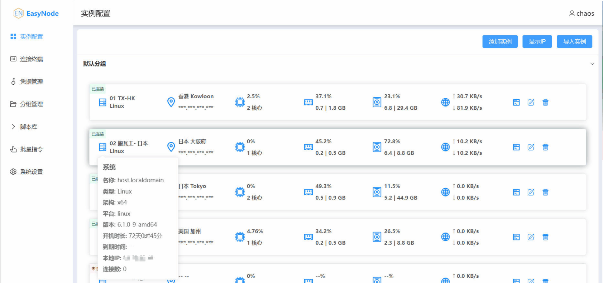

<div align="center">

# EasyNode

_✨ 一个多功能Linux服务器终端面板(webSSH&webSFTP) ✨_

</div>

<p align="center">
  <a href="https://github.com/chaos-zhu/easynode/releases/latest">
    
  </a>
  <a href="https://github.com/chaos-zhu/easynode/actions">
    
  </a>
  <a href="https://hub.docker.com/repository/docker/chaoszhu/easynode">
    
  </a>
  <a href="https://github.com/chaos-zhu/easynode/releases/latest">
    
  </a>
</p>

<p align="center">
  <a href="#功能">功能</a>
  ·
  <a href="#面板展示">面板展示</a>
  ·
  <a href="#移动端展示">移动端展示</a>
  ·
  <a href="#项目部署">项目部署</a>
  ·
  <a href="#监控服务安装">监控服务安装</a>
  ·
  <a href="#建议">建议</a>
  ·
  <a href="#声明">声明</a>
  ·
  <a href="#常见问题">常见问题</a>
</p>

## 功能

+ [x] 功能完善的**SSH终端**&**SFTP**
+ [x] AI agent组件 🤖
+ [x] 批量导入、导出、编辑服务器配置、脚本等
+ [x] 脚本库
+ [x] 实例分组
+ [x] 凭据托管
+ [x] 多渠道通知
+ [x] 批量下发指令
+ [x] 自定义终端主题
+ [x] Native移动端，支持iOS / Android原生SSH、SFTP、Docker、脚本库等能力

## 面板展示



## 移动端展示

Native端复用现有EasyNode后端，在移动设备上提供服务器管理、原生SSH终端、SFTP文件管理、Docker、脚本库和服务器状态等能力。

<p align="center">
  
</p>

## 项目部署

### 默认账号与密码查看

- 首次启动后会在终端自动生成管理员账号密码，登录后请及时修改，避免日志残留敏感信息。
- 请牢记账号密码；Docker 部署如需重置密码，可使用下方的维护脚本。
- 访问：
  - https安全访问：https://ip:8092  【注意：默认启用https自签证书加密访问，首次打开需在浏览器中手动跳过 https 证书错误提示：浏览器页面中点 高级 --> 继续前往】
  - http 内网访问：http://ip:8082  【切记：开放公网访问**请勿使用http**，仓库提供的 docker-compose.yml 文件默认仅127.0.0.1内网访问】
ps：仓库提供的 docker-compose.yml 文件默认启用变量`COOKIE_SECURE=true`, 此时http协议无法正常使用，如需非加密访问，请注释`COOKIE_SECURE=true`

### docker-compose部署

> 无特殊需求建议使用docker-compose.yml一键启动

部署本项目的[docker-compose.yml](https://github.com/chaos-zhu/easynode/blob/main/docker-compose.yml)默认采用[腾讯云CNB自动构建镜像](https://cnb.cool/chaoszhu/easynode)，如发现服务不可用请自行替换或移除加速

```shell
# docker compose快速部署

# 1. 创建easynode目录
mkdir -p /root/easynode && cd /root/easynode

# 2. 下载docker-compose.yml文件（含watchtower自动更新）
wget https://git.221022.xyz/https://raw.githubusercontent.com/chaos-zhu/easynode/main/docker-compose.yml

# 3. 启动服务
docker compose up -d
```

<details>
<summary><strong>Docker 维护脚本</strong></summary>

<br>

以下脚本仅支持 Docker Compose 部署。请在 `docker-compose.yml` 所在目录执行，并严格按照“停止服务 → 运行一次性维护容器 → 恢复服务”的顺序操作，避免多个进程同时写入数据库。

> [!WARNING]
> 执行任何维护脚本前，必须先使用 `docker compose stop easynode` 完全停止 EasyNode 主容器。禁止通过 `docker exec` 在运行中的容器内执行这些脚本，否则多个进程同时写入 NeDB，可能造成数据覆盖或数据库损坏。

#### 重置管理员用户名和密码

```shell
docker compose stop easynode
docker compose run --rm --no-deps easynode node scripts/reset-password.js
docker compose up -d easynode
```

脚本启动后会要求确认，只有输入 `y` 或 `Y` 才会继续。确认后将生成并输出新的随机管理员用户名和密码，同时使所有现有登录会话失效。请使用新凭据登录后立即修改用户名和密码。

#### 移除 MFA

```shell
docker compose stop easynode
docker compose run --rm --no-deps easynode node scripts/remove-mfa.js
docker compose up -d easynode
```

脚本会关闭管理员账号的 MFA 并删除现有 TOTP 密钥，不会修改用户名或密码。服务恢复后请尽快重新启用 MFA。

#### 移除所有 IP 白名单

```shell
docker compose stop easynode
docker compose run --rm --no-deps easynode node scripts/remove-ip-whitelist.js
docker compose up -d easynode
```

脚本会清空当前及旧版兼容的全部 IP 访问规则。服务恢复后所有来源 IP 均可访问面板，请尽快重新配置 IP 白名单，并避免将未受保护的面板暴露到公网。

</details>

## 环境变量

| 变量名称 | 说明 | 默认值 | 备注 |
|---------|------|--------|------|
| `GUACD_HOST` | 自建guacd服务IP | - | docker-compose 已配置 |
| `GUACD_PORT` | 自建guacd服务PORT | - | docker-compose 已配置 |
| `DEBUG` | 启动日志 | `true` | `false`：关闭，`true`：开启 |
| `RDP_PORT` | RDP服务端口 | - | 无特殊需求保持默认即可 |
| `ENABLE_HTTPS` | 是否启用HTTPS | `1` | `0`：关闭<br/>`1`：自签证书（适合内网）<br/>`2`：合法证书（适合外网）<br/>外网建议使用 nginx/caddy 进行 HTTPS 转发 |
| `COOKIE_SECURE` | Session Cookie 是否仅通过 HTTPS 发送 | `false` | `true`：启用 Secure 标志，仅可通过 HTTPS 登录；仓库提供的 docker-compose 默认为 `true` |
| `HTTPS_PORT` | HTTPS端口 | `8092` | 默认启用，请使用 https 访问web端 |
| `SSL_CERT_PATH` | HTTPS证书文件路径 | - | 当 `ENABLE_HTTPS=2` 时必须配置 |
| `SSL_KEY_PATH` | HTTPS私钥文件路径 | - | 当 `ENABLE_HTTPS=2` 时必须配置 |

注意: **docker默认不启用ipv6，请参考Q&A配置或者使用支持ipv6的跳板机中转.**

## 建议

> 任何系统无法保障没有bug的存在，EasyNode也一样。

1. 请妥善利用面板提供MFA2、IP白名单等安全功能, 如需加强建议搭配**OpenVPN**、**TailScale** 等手段访问。**建议面板服务不要暴露到公网**。

2. webssh与监控服务都将以`该服务器作为中转`。中国大陆用户建议使用香港、新加坡、日本、韩国等地区的低延迟服务器来安装服务端面板。

3. 及时升级面板，EasyNode会不定期升级底层安全依赖。建议使用上面提供的docker-compose.yml一键部署，可自动检测更新并升级。

## 声明

EasyNode于2022年8月首次发布，作者在开发该面板时已尽可能确保其安全性。EasyNode同其他项目一样，都会依赖流行的第三方库，而这些第三方库的安全性无法得到永久保障。因此，如果您的服务器具备重要的数据价值，请避免将该项目部署在公网环境或者不使用此项目。对于因安全漏洞造成的任何损失，作者概不承担任何责任。

---

## 常见问题

- [QA](./Q%26A.md)

## 测试服务由以下厂商赞助

CDN acceleration and security protection for this project are sponsored by Tencent EdgeOne: EdgeOne offers a long-term free plan with unlimited traffic and requests, covering Mainland China nodes, with no overage charges. Interested friends can click the link below to claim it. [Best Asian CDN, Edge, and Secure Solutions - Tencent EdgeOne](https://edgeone.ai/zh?from=github)
[](https://edgeone.ai/?from=github)


 [](https://yxvm.com/)


