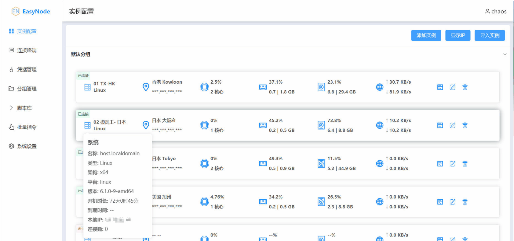

<div align="center">

# EasyNode

_✨ A multifunctional Linux server web terminal panel `webSSH` & `webSFTP` ✨_

**Default documentation language: 中文** -> [`README.md`](README.md)

</div>

<p align="center">
  <a href="https://github.com/chaos-zhu/easynode/releases/latest">
    
  </a>
  <a href="https://github.com/chaos-zhu/easynode/actions">
    
  </a>
  <a href="https://hub.docker.com/repository/docker/chaoszhu/easynode">
    
  </a>
  <a href="https://github.com/chaos-zhu/easynode/releases/latest">
    
  </a>
</p>

<p align="center">
  <a href="#features">Features</a>
  ·
  <a href="#preview">Preview</a>
  ·
  <a href="#deployment">Deployment</a>
  ·
  <a href="#environment-variables">Environment Variables</a>
  ·
  <a href="#monitoring-service">Monitoring Service</a>
  ·
  <a href="#recommendations">Recommendations</a>
  ·
  <a href="#disclaimer">Disclaimer</a>
  ·
  <a href="#faq">FAQ</a>
</p>

## Features

- [x] Full-featured **SSH terminal** & **SFTP**
- [x] Jump host support for bypassing connectivity restrictions and improving cross-region terminal input speed
- [x] AI chat component with terminal interaction support
- [x] Batch import, export, and editing for servers, scripts, and related configurations
- [x] Script library
- [x] Server grouping
- [x] Credential management
- [x] Multi-channel notifications
- [x] Batch command execution
- [x] Custom terminal themes

## Preview



## Deployment

- Since version `v3.1.0`, the default username/password is no longer `admin/admin`. Check the **terminal logs** after startup. Please change the credentials immediately after logging in to avoid sensitive information remaining in logs. For security reasons, there is no one-click password reset script.
- Default web port: **8082**

### docker-compose Deployment - Auto Update Recommended

The [`docker-compose.yml`](docker-compose.yml) used for this project defaults to images accelerated via Tencent CNB. If the service is unavailable, replace or remove the acceleration source manually.

```shell
# Quick deployment with docker compose

# 1. Create the easynode directory
mkdir -p /root/easynode && cd /root/easynode

# 2. Download the docker-compose.yml file
wget https://git.221022.xyz/https://raw.githubusercontent.com/chaos-zhu/easynode/main/docker-compose.yml

# 3. Start the service
docker compose up -d
```

### Docker Image

**Important!!!**

**Starting from `v3.5.0`, RDP support for Windows servers was added. This feature depends on a separate `guacd` service.**

- If you are not familiar with `guacd`, use the [`docker-compose.yml`](docker-compose.yml) above for deployment.
- If you do not want to use [`docker-compose.yml`](docker-compose.yml), configure the environment variables `GUACD_HOST` and `GUACD_PORT` manually.

```shell
# GUACD_HOST: IP of your self-hosted guacd service (127.0.0.1 here is only an example)
# GUACD_PORT: Port of your self-hosted guacd service
docker run -d \
  -p 8082:8082 \
  --restart=always \
  -v /root/easynode/db:/easynode/app/db \
  -e GUACD_HOST=127.0.0.1 \
  -e GUACD_PORT=4822 \
  chaoszhu/easynode
```

## Environment Variables

> If you do not have special requirements, using [`docker-compose.yml`](docker-compose.yml) is recommended.

| Variable | Description | Default | Notes |
|---------|------|--------|------|
| `GUACD_HOST` | IP of your self-hosted guacd service | - | - |
| `GUACD_PORT` | Port of your self-hosted guacd service | - | - |
| `DEBUG` | Startup log output | `true` | `false`: disabled, `true`: enabled |
| `RDP_PORT` | RDP service port | - | Keep the default unless necessary |
| `ENABLE_HTTPS` | Whether to enable HTTPS | `0` | `0`: disabled<br/>`1`: self-signed certificate (suitable for LAN)<br/>`2`: valid certificate (suitable for public network)<br/>Using `nginx` / `caddy` for HTTPS reverse proxy is recommended for public deployment |
| `HTTPS_PORT` | HTTPS port | `8092` | - |
| `SSL_CERT_PATH` | HTTPS certificate file path | - | Required when `ENABLE_HTTPS=2` |
| `SSL_KEY_PATH` | HTTPS private key file path | - | Required when `ENABLE_HTTPS=2` |

Note: Docker does not enable IPv6 by default. Please refer to [`Q&A.md`](Q&A.md) or use a jump host that supports IPv6.

## Monitoring Service

Starting from `v3.2.0`, a separate monitoring service is no longer required. Older panel versions no longer provide a downloadable monitoring client, so upgrading is recommended.

If a monitoring service was previously installed on your server, use the built-in uninstall script: `Script Library -> easynode monitoring service uninstall`.

## Recommendations

> No system is completely free of bugs, and EasyNode is no exception.

1. Make good use of security features such as MFA2 and the IP allowlist. For stronger security, LAN deployment is recommended, together with **OpenVPN**, `tailscale`, or `zerotier`. If you need a higher security level, do not expose the panel service directly to the public internet.
2. Both `webssh` and the monitoring service use **the target server as a relay**. Users in Mainland China are advised to deploy the panel on low-latency servers located in Hong Kong, Singapore, Japan, or South Korea.
3. Upgrade the panel regularly. EasyNode periodically updates its underlying security dependencies. Using the provided [`docker-compose.yml`](docker-compose.yml) is recommended because it can detect updates and upgrade automatically.

## Disclaimer

EasyNode was first released in August 2022. The author has made every effort to improve its security during development. However, like other projects, EasyNode depends on popular third-party libraries, whose security cannot be guaranteed forever. If your server contains important data, avoid deploying this project directly on the public internet, or avoid using the project altogether. The author assumes no responsibility for any loss caused by security vulnerabilities.

---

## FAQ

- [`Q&A.md`](Q&A.md)

## Sponsored Infrastructure

CDN acceleration and security protection for this project are sponsored by Tencent EdgeOne. EdgeOne offers a long-term free plan with unlimited traffic and requests, including Mainland China nodes and no overage charges. Interested users can check it here: [Best Asian CDN, Edge, and Secure Solutions - Tencent EdgeOne](https://edgeone.ai/zh?from=github)

[](https://edgeone.ai/?from=github)

 [](https://yxvm.com/)
